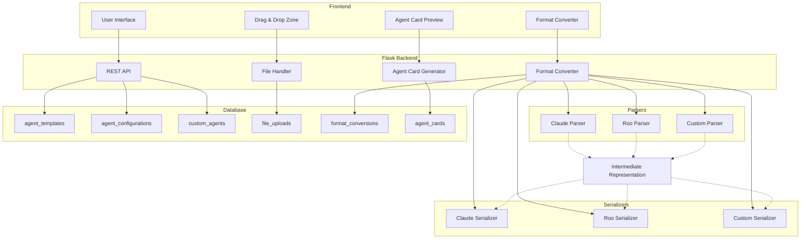
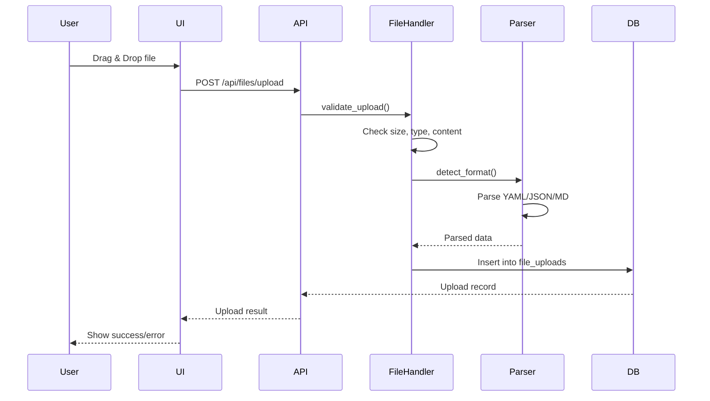
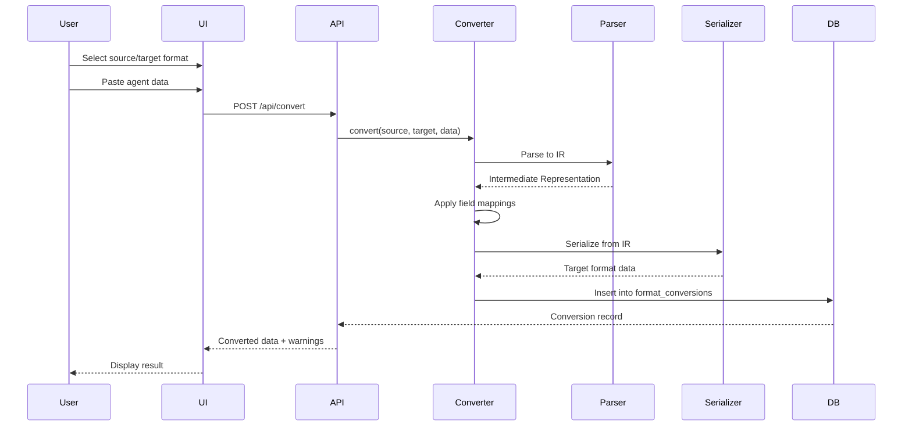
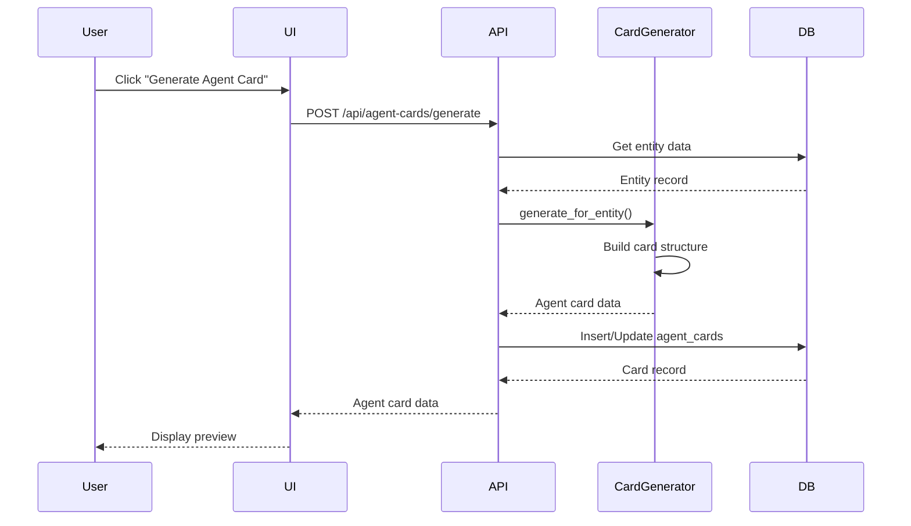

# Agent Modes Database - Architecture Design

## Table of Contents

1. [Overview](#overview)
2. [Current Architecture](#current-architecture)
3. [Database Schema Changes](#database-schema-changes)
4. [API Endpoints Design](#api-endpoints-design)
5. [Frontend Components Design](#frontend-components-design)
6. [Format Conversion Logic](#format-conversion-logic)
7. [Agent Card Schema](#agent-card-schema)
8. [Technology Additions](#technology-additions)
9. [File Structure Changes](#file-structure-changes)
10. [Migration Strategy](#migration-strategy)
11. [Security Considerations](#security-considerations)

---

## Overview

This document describes the architecture for adding four major features to the agent-modes-db Flask application:

1. **Drag and Drop File Upload** - Import agent definition files (YAML, JSON, MD)
2. **Template Creation from New Agent Formats** - Reverse flow: create templates from imported definitions
3. **Universal Converter Between Agent Formats** - Transform agent definitions between Claude, Roo, and other formats
4. **Agent Card Generation for Microsoft Discoverability** - Generate standardized agent discovery cards

### Current Architecture Summary

- **Backend**: Flask 3.0.0 with SQLite database
- **Frontend**: HTML5, Bootstrap 5, vanilla JavaScript
- **Database**: 3 tables (agent_templates, agent_configurations, custom_agents)
- **API**: RESTful with full CRUD operations
- **Current Limitations**: JSON-only format, no file upload, no format conversion

---

## Current Architecture

### Existing Database Schema

```sql
-- Agent Templates Table
CREATE TABLE IF NOT EXISTS agent_templates (
    id INTEGER PRIMARY KEY AUTOINCREMENT,
    name TEXT NOT NULL,
    description TEXT NOT NULL,
    category TEXT NOT NULL,
    is_builtin BOOLEAN NOT NULL DEFAULT 0,
    created_at TIMESTAMP DEFAULT CURRENT_TIMESTAMP,
    updated_at TIMESTAMP DEFAULT CURRENT_TIMESTAMP
);

-- Agent Configurations Table
CREATE TABLE IF NOT EXISTS agent_configurations (
    id INTEGER PRIMARY KEY AUTOINCREMENT,
    template_id INTEGER,
    name TEXT NOT NULL,
    config_json TEXT NOT NULL,
    created_at TIMESTAMP DEFAULT CURRENT_TIMESTAMP,
    updated_at TIMESTAMP DEFAULT CURRENT_TIMESTAMP,
    FOREIGN KEY (template_id) REFERENCES agent_templates(id) ON DELETE SET NULL
);

-- Custom Agents Table
CREATE TABLE IF NOT EXISTS custom_agents (
    id INTEGER PRIMARY KEY AUTOINCREMENT,
    name TEXT NOT NULL,
    description TEXT NOT NULL,
    capabilities TEXT NOT NULL,
    tools TEXT NOT NULL,
    system_prompt TEXT NOT NULL,
    config_schema TEXT,
    created_at TIMESTAMP DEFAULT CURRENT_TIMESTAMP,
    updated_at TIMESTAMP DEFAULT CURRENT_TIMESTAMP
);
```

### Existing API Endpoints

| Method | Endpoint | Description |
|--------|----------|-------------|
| GET | `/api/templates` | List all templates |
| GET | `/api/templates/<id>` | Get specific template |
| POST | `/api/templates` | Create new template |
| PUT | `/api/templates/<id>` | Update template |
| DELETE | `/api/templates/<id>` | Delete template |
| GET | `/api/configurations` | List all configurations |
| GET | `/api/configurations/<id>` | Get specific configuration |
| POST | `/api/configurations` | Create new configuration |
| PUT | `/api/configurations/<id>` | Update configuration |
| DELETE | `/api/configurations/<id>` | Delete configuration |
| GET | `/api/custom-agents` | List all custom agents |
| GET | `/api/custom-agents/<id>` | Get specific custom agent |
| POST | `/api/custom-agents` | Create new custom agent |
| PUT | `/api/custom-agents/<id>` | Update custom agent |
| DELETE | `/api/custom-agents/<id>` | Delete custom agent |

---

## Database Schema Changes

### New Tables

#### 1. File Uploads Table

Stores metadata about uploaded files for tracking and history.

```sql
CREATE TABLE IF NOT EXISTS file_uploads (
    id INTEGER PRIMARY KEY AUTOINCREMENT,
    filename TEXT NOT NULL,
    original_filename TEXT NOT NULL,
    file_format TEXT NOT NULL,  -- 'yaml', 'json', 'md'
    file_size INTEGER NOT NULL,
    upload_status TEXT NOT NULL DEFAULT 'pending',  -- 'pending', 'processing', 'completed', 'failed'
    parse_result TEXT,  -- JSON string of parsed data
    error_message TEXT,
    uploaded_at TIMESTAMP DEFAULT CURRENT_TIMESTAMP,
    processed_at TIMESTAMP
);

CREATE INDEX IF NOT EXISTS idx_file_uploads_status ON file_uploads(upload_status);
CREATE INDEX IF NOT EXISTS idx_file_uploads_format ON file_uploads(file_format);
```

#### 2. Format Conversions Table

Tracks format conversion operations for audit and history.

```sql
CREATE TABLE IF NOT EXISTS format_conversions (
    id INTEGER PRIMARY KEY AUTOINCREMENT,
    source_format TEXT NOT NULL,  -- 'claude', 'roo', 'custom'
    target_format TEXT NOT NULL,  -- 'claude', 'roo', 'custom'
    source_data TEXT NOT NULL,  -- JSON string
    target_data TEXT NOT NULL,  -- JSON string
    conversion_status TEXT NOT NULL DEFAULT 'success',  -- 'success', 'failed'
    error_message TEXT,
    created_at TIMESTAMP DEFAULT CURRENT_TIMESTAMP
);

CREATE INDEX IF NOT EXISTS idx_conversions_source ON format_conversions(source_format);
CREATE INDEX IF NOT EXISTS idx_conversions_target ON format_conversions(target_format);
```

#### 3. Agent Cards Table

Stores generated agent cards for Microsoft discoverability.

```sql
CREATE TABLE IF NOT EXISTS agent_cards (
    id INTEGER PRIMARY KEY AUTOINCREMENT,
    entity_type TEXT NOT NULL,  -- 'template', 'configuration', 'custom_agent'
    entity_id INTEGER NOT NULL,
    card_data TEXT NOT NULL,  -- JSON string of agent card
    card_version TEXT NOT NULL DEFAULT '1.0',
    published BOOLEAN NOT NULL DEFAULT 0,
    generated_at TIMESTAMP DEFAULT CURRENT_TIMESTAMP,
    updated_at TIMESTAMP DEFAULT CURRENT_TIMESTAMP,
    UNIQUE(entity_type, entity_id)
);

CREATE INDEX IF NOT EXISTS idx_agent_cards_entity ON agent_cards(entity_type, entity_id);
CREATE INDEX IF NOT EXISTS idx_agent_cards_published ON agent_cards(published);
```

### Modified Tables

#### 1. Agent Templates Table Enhancement

Add columns to track source format and origin.

```sql
-- Add new columns to agent_templates
ALTER TABLE agent_templates ADD COLUMN source_format TEXT;  -- 'claude', 'roo', 'custom', 'manual'
ALTER TABLE agent_templates ADD COLUMN source_file_id INTEGER;  -- Reference to file_uploads
ALTER TABLE agent_templates ADD COLUMN is_imported BOOLEAN NOT NULL DEFAULT 0;

-- Add foreign key constraint
CREATE INDEX IF NOT EXISTS idx_templates_source_file ON agent_templates(source_file_id);
```

#### 2. Custom Agents Table Enhancement

Add columns for format tracking.

```sql
-- Add new columns to custom_agents
ALTER TABLE custom_agents ADD COLUMN source_format TEXT;  -- 'claude', 'roo', 'custom', 'manual'
ALTER TABLE custom_agents ADD COLUMN source_file_id INTEGER;  -- Reference to file_uploads
ALTER TABLE custom_agents ADD COLUMN is_imported BOOLEAN NOT NULL DEFAULT 0;

-- Add foreign key constraint
CREATE INDEX IF NOT EXISTS idx_custom_agents_source_file ON custom_agents(source_file_id);
```

---

## API Endpoints Design

### File Upload Endpoints

#### POST `/api/files/upload`

Upload agent definition files.

**Request:**
- Content-Type: `multipart/form-data`
- Body: Form data with file(s)

**Response (Success - 201):**
```json
{
  "upload_id": 1,
  "filename": "agent_definition.yaml",
  "original_filename": "my-agent.yaml",
  "file_format": "yaml",
  "file_size": 2048,
  "upload_status": "completed",
  "parse_result": {
    "name": "Code Analyzer",
    "description": "Analyzes code structure",
    "capabilities": ["code-analysis", "pattern-matching"],
    "tools": ["file-read", "regex"],
    "system_prompt": "You are a code analyzer..."
  },
  "uploaded_at": "2026-02-07T12:00:00Z"
}
```

**Response (Error - 400):**
```json
{
  "error": "Invalid file format. Supported formats: YAML, JSON, MD"
}
```

#### POST `/api/files/upload/multiple`

Upload multiple files at once.

**Request:**
- Content-Type: `multipart/form-data`
- Body: Form data with multiple files

**Response (Success - 201):**
```json
{
  "uploads": [
    {
      "upload_id": 1,
      "filename": "agent1.yaml",
      "file_format": "yaml",
      "upload_status": "completed",
      "parse_result": {...}
    },
    {
      "upload_id": 2,
      "filename": "agent2.json",
      "file_format": "json",
      "upload_status": "completed",
      "parse_result": {...}
    }
  ],
  "total": 2,
  "successful": 2,
  "failed": 0
}
```

#### GET `/api/files`

List all file uploads.

**Query Parameters:**
- `status` (optional): Filter by upload status
- `format` (optional): Filter by file format

**Response (Success - 200):**
```json
{
  "uploads": [
    {
      "id": 1,
      "filename": "agent_definition.yaml",
      "file_format": "yaml",
      "file_size": 2048,
      "upload_status": "completed",
      "uploaded_at": "2026-02-07T12:00:00Z"
    }
  ],
  "total": 1
}
```

#### GET `/api/files/<upload_id>`

Get details of a specific file upload.

**Response (Success - 200):**
```json
{
  "id": 1,
  "filename": "agent_definition.yaml",
  "original_filename": "my-agent.yaml",
  "file_format": "yaml",
  "file_size": 2048,
  "upload_status": "completed",
  "parse_result": {
    "name": "Code Analyzer",
    "description": "Analyzes code structure",
    "capabilities": ["code-analysis", "pattern-matching"],
    "tools": ["file-read", "regex"],
    "system_prompt": "You are a code analyzer..."
  },
  "uploaded_at": "2026-02-07T12:00:00Z",
  "processed_at": "2026-02-07T12:00:01Z"
}
```

#### DELETE `/api/files/<upload_id>`

Delete a file upload record.

**Response (Success - 200):**
```json
{
  "message": "File upload deleted successfully"
}
```

### Template Creation from Import Endpoints

#### POST `/api/templates/from-upload`

Create a template from an uploaded file.

**Request:**
```json
{
  "upload_id": 1,
  "name": "Code Analyzer",
  "description": "Analyzes code structure and patterns",
  "category": "Development",
  "edit_data": {
    "capabilities": ["code-analysis", "pattern-matching", "security-scan"]
  }
}
```

**Response (Success - 201):**
```json
{
  "id": 10,
  "name": "Code Analyzer",
  "description": "Analyzes code structure and patterns",
  "category": "Development",
  "source_format": "yaml",
  "source_file_id": 1,
  "is_imported": true,
  "message": "Template created successfully from uploaded file"
}
```

#### POST `/api/templates/from-data`

Create a template from parsed agent data.

**Request:**
```json
{
  "source_format": "claude",
  "agent_data": {
    "name": "Code Analyzer",
    "description": "Analyzes code structure",
    "capabilities": ["code-analysis"],
    "tools": ["file-read"],
    "system_prompt": "You are a code analyzer..."
  },
  "name": "Code Analyzer",
  "description": "Analyzes code structure and patterns",
  "category": "Development"
}
```

**Response (Success - 201):**
```json
{
  "id": 10,
  "name": "Code Analyzer",
  "description": "Analyzes code structure and patterns",
  "category": "Development",
  "source_format": "claude",
  "is_imported": true,
  "message": "Template created successfully from agent data"
}
```

### Format Conversion Endpoints

#### POST `/api/convert`

Convert agent definition between formats.

**Request:**
```json
{
  "source_format": "claude",
  "target_format": "roo",
  "agent_data": {
    "name": "Code Analyzer",
    "description": "Analyzes code structure",
    "capabilities": ["code-analysis"],
    "tools": ["file-read"],
    "system_prompt": "You are a code analyzer..."
  }
}
```

**Response (Success - 200):**
```json
{
  "conversion_id": 1,
  "source_format": "claude",
  "target_format": "roo",
  "source_data": {...},
  "target_data": {
    "mode": "code-analyzer",
    "name": "Code Analyzer",
    "description": "Analyzes code structure",
    "capabilities": ["code-analysis"],
    "tools": ["file-read"],
    "system_prompt": "You are a code analyzer...",
    "icon": "fa-code",
    "category": "development"
  },
  "conversion_status": "success",
  "warnings": [
    "Field 'icon' was added with default value"
  ],
  "created_at": "2026-02-07T12:00:00Z"
}
```

#### POST `/api/convert/file`

Convert an uploaded file to a different format.

**Request:**
```json
{
  "upload_id": 1,
  "target_format": "roo"
}
```

**Response (Success - 200):**
```json
{
  "conversion_id": 1,
  "source_format": "yaml",
  "target_format": "roo",
  "target_data": {...},
  "conversion_status": "success",
  "created_at": "2026-02-07T12:00:00Z"
}
```

#### GET `/api/convert/history`

Get conversion history.

**Query Parameters:**
- `source_format` (optional): Filter by source format
- `target_format` (optional): Filter by target format
- `limit` (optional): Maximum number of results (default: 50)

**Response (Success - 200):**
```json
{
  "conversions": [
    {
      "id": 1,
      "source_format": "claude",
      "target_format": "roo",
      "conversion_status": "success",
      "created_at": "2026-02-07T12:00:00Z"
    }
  ],
  "total": 1
}
```

#### GET `/api/convert/formats`

Get list of supported formats.

**Response (Success - 200):**
```json
{
  "formats": [
    {
      "id": "claude",
      "name": "Claude Agent",
      "description": "Anthropic Claude agent format",
      "version": "1.0"
    },
    {
      "id": "roo",
      "name": "Roo Agent",
      "description": "Roo Code agent format",
      "version": "1.0"
    },
    {
      "id": "custom",
      "name": "Custom Agent",
      "description": "Application-specific custom agent format",
      "version": "1.0"
    }
  ]
}
```

### Agent Card Endpoints

#### POST `/api/agent-cards/generate`

Generate an agent card for an entity.

**Request:**
```json
{
  "entity_type": "template",
  "entity_id": 1
}
```

**Response (Success - 201):**
```json
{
  "id": 1,
  "entity_type": "template",
  "entity_id": 1,
  "card_data": {
    "schema": "https://agent-discovery.microsoft.com/v1",
    "agent": {
      "id": "agent-modes-db-template-1",
      "name": "Code Explorer",
      "description": "Specialized agent for exploring and understanding codebases",
      "version": "1.0.0",
      "category": "Development",
      "capabilities": ["code-exploration", "code-analysis", "documentation"],
      "author": {
        "name": "Agent Modes DB",
        "url": "https://github.com/agent-modes-db"
      },
      "metadata": {
        "created_at": "2026-02-07T12:00:00Z",
        "updated_at": "2026-02-07T12:00:00Z",
        "tags": ["code", "exploration", "analysis"]
      }
    }
  },
  "card_version": "1.0",
  "published": false,
  "generated_at": "2026-02-07T12:00:00Z"
}
```

#### POST `/api/agent-cards/generate/batch`

Generate agent cards for multiple entities.

**Request:**
```json
{
  "entities": [
    {"entity_type": "template", "entity_id": 1},
    {"entity_type": "custom_agent", "entity_id": 1},
    {"entity_type": "configuration", "entity_id": 1}
  ]
}
```

**Response (Success - 201):**
```json
{
  "cards": [
    {
      "id": 1,
      "entity_type": "template",
      "entity_id": 1,
      "card_data": {...},
      "generated_at": "2026-02-07T12:00:00Z"
    }
  ],
  "total": 1,
  "successful": 1,
  "failed": 0
}
```

#### GET `/api/agent-cards`

List all agent cards.

**Query Parameters:**
- `entity_type` (optional): Filter by entity type
- `published` (optional): Filter by published status (true/false)

**Response (Success - 200):**
```json
{
  "cards": [
    {
      "id": 1,
      "entity_type": "template",
      "entity_id": 1,
      "card_version": "1.0",
      "published": false,
      "generated_at": "2026-02-07T12:00:00Z",
      "updated_at": "2026-02-07T12:00:00Z"
    }
  ],
  "total": 1
}
```

#### GET `/api/agent-cards/<card_id>`

Get a specific agent card.

**Response (Success - 200):**
```json
{
  "id": 1,
  "entity_type": "template",
  "entity_id": 1,
  "card_data": {
    "schema": "https://agent-discovery.microsoft.com/v1",
    "agent": {...}
  },
  "card_version": "1.0",
  "published": false,
  "generated_at": "2026-02-07T12:00:00Z",
  "updated_at": "2026-02-07T12:00:00Z"
}
```

#### PUT `/api/agent-cards/<card_id>/publish`

Publish an agent card.

**Response (Success - 200):**
```json
{
  "id": 1,
  "published": true,
  "updated_at": "2026-02-07T12:00:00Z",
  "message": "Agent card published successfully"
}
```

#### PUT `/api/agent-cards/<card_id>/unpublish`

Unpublish an agent card.

**Response (Success - 200):**
```json
{
  "id": 1,
  "published": false,
  "updated_at": "2026-02-07T12:00:00Z",
  "message": "Agent card unpublished successfully"
}
```

#### DELETE `/api/agent-cards/<card_id>`

Delete an agent card.

**Response (Success - 200):**
```json
{
  "message": "Agent card deleted successfully"
}
```

#### GET `/api/agent-cards/<card_id>/export`

Export an agent card in specified format.

**Query Parameters:**
- `format` (required): Export format (`json`, `yaml`)

**Response (Success - 200):**
```json
{
  "format": "json",
  "content": {...},
  "filename": "agent-card-1.json"
}
```

---

## Frontend Components Design

### 1. Drag and Drop Zone Component

**Location:** `templates/components/dropzone.html`

**HTML Structure:**
```html
<div id="dropzone" class="dropzone-container">
  <div class="dropzone-content">
    <i class="fas fa-cloud-upload-alt fa-3x text-primary"></i>
    <h4 class="mt-3">Drag & Drop Agent Files Here</h4>
    <p class="text-muted">or click to browse</p>
    <p class="small text-muted">Supported formats: YAML, JSON, MD</p>
    <input type="file" id="fileInput" multiple accept=".yaml,.yml,.json,.md" hidden>
  </div>
  <div class="dropzone-preview" id="dropzonePreview"></div>
</div>
```

**CSS Styles:**
```css
.dropzone-container {
  border: 3px dashed #667eea;
  border-radius: 12px;
  padding: 40px;
  text-align: center;
  transition: all 0.3s ease;
  background-color: #f8f9fa;
  min-height: 200px;
  position: relative;
}

.dropzone-container.dragover {
  border-color: #764ba2;
  background-color: #e9ecef;
  transform: scale(1.02);
}

.dropzone-preview {
  margin-top: 20px;
}

.file-preview-item {
  background: white;
  border-radius: 8px;
  padding: 12px;
  margin-bottom: 8px;
  display: flex;
  align-items: center;
  justify-content: space-between;
  box-shadow: 0 2px 4px rgba(0,0,0,0.1);
}

.file-preview-item.success {
  border-left: 4px solid #28a745;
}

.file-preview-item.error {
  border-left: 4px solid #dc3545;
}
```

**JavaScript Logic:**
```javascript
class Dropzone {
  constructor(elementId, options = {}) {
    this.dropzone = document.getElementById(elementId);
    this.fileInput = this.dropzone.querySelector('input[type="file"]');
    this.preview = document.getElementById('dropzonePreview');
    this.options = {
      maxFileSize: 10 * 1024 * 1024, // 10MB
      allowedFormats: ['yaml', 'yml', 'json', 'md'],
      onFileSelected: null,
      onUploadComplete: null,
      ...options
    };
    this.init();
  }

  init() {
    // Drag and drop events
    this.dropzone.addEventListener('dragover', (e) => this.handleDragOver(e));
    this.dropzone.addEventListener('dragleave', (e) => this.handleDragLeave(e));
    this.dropzone.addEventListener('drop', (e) => this.handleDrop(e));
    
    // Click to browse
    this.dropzone.addEventListener('click', (e) => {
      if (e.target === this.dropzone || e.target.closest('.dropzone-content')) {
        this.fileInput.click();
      }
    });
    
    // File input change
    this.fileInput.addEventListener('change', (e) => this.handleFileSelect(e));
  }

  handleDragOver(e) {
    e.preventDefault();
    this.dropzone.classList.add('dragover');
  }

  handleDragLeave(e) {
    e.preventDefault();
    this.dropzone.classList.remove('dragover');
  }

  handleDrop(e) {
    e.preventDefault();
    this.dropzone.classList.remove('dragover');
    const files = Array.from(e.dataTransfer.files);
    this.processFiles(files);
  }

  handleFileSelect(e) {
    const files = Array.from(e.target.files);
    this.processFiles(files);
  }

  processFiles(files) {
    files.forEach(file => {
      if (this.validateFile(file)) {
        this.uploadFile(file);
      }
    });
  }

  validateFile(file) {
    const extension = file.name.split('.').pop().toLowerCase();
    if (!this.options.allowedFormats.includes(extension)) {
      this.showError(file.name, `Invalid file format: ${extension}`);
      return false;
    }
    if (file.size > this.options.maxFileSize) {
      this.showError(file.name, 'File size exceeds 10MB limit');
      return false;
    }
    return true;
  }

  async uploadFile(file) {
    const previewItem = this.createPreviewItem(file.name, 'uploading');
    this.preview.appendChild(previewItem);

    const formData = new FormData();
    formData.append('file', file);

    try {
      const response = await fetch('/api/files/upload', {
        method: 'POST',
        body: formData
      });
      const result = await response.json();

      if (response.ok) {
        this.updatePreviewItem(previewItem, 'success', result);
        if (this.options.onUploadComplete) {
          this.options.onUploadComplete(result);
        }
      } else {
        this.updatePreviewItem(previewItem, 'error', result.error);
      }
    } catch (error) {
      this.updatePreviewItem(previewItem, 'error', error.message);
    }
  }

  createPreviewItem(filename, status) {
    const item = document.createElement('div');
    item.className = `file-preview-item ${status}`;
    item.innerHTML = `
      <div class="file-info">
        <i class="fas fa-file-alt me-2"></i>
        <span>${filename}</span>
      </div>
      <div class="file-status">
        ${status === 'uploading' ? '<i class="fas fa-spinner fa-spin"></i>' : ''}
      </div>
    `;
    return item;
  }

  updatePreviewItem(item, status, data) {
    item.className = `file-preview-item ${status}`;
    const statusDiv = item.querySelector('.file-status');
    if (status === 'success') {
      statusDiv.innerHTML = '<i class="fas fa-check-circle text-success"></i>';
    } else {
      statusDiv.innerHTML = `<i class="fas fa-exclamation-circle text-danger"></i>`;
      const errorDiv = document.createElement('div');
      errorDiv.className = 'text-danger small mt-1';
      errorDiv.textContent = data;
      item.appendChild(errorDiv);
    }
  }

  showError(filename, message) {
    const previewItem = this.createPreviewItem(filename, 'error');
    const errorDiv = document.createElement('div');
    errorDiv.className = 'text-danger small mt-1';
    errorDiv.textContent = message;
    previewItem.appendChild(errorDiv);
    this.preview.appendChild(previewItem);
  }
}
```

### 2. File Upload Modal

**Location:** `templates/modals/file-upload-modal.html`

**HTML Structure:**
```html
<div class="modal fade" id="fileUploadModal" tabindex="-1">
  <div class="modal-dialog modal-lg">
    <div class="modal-content">
      <div class="modal-header">
        <h5 class="modal-title">Import Agent Definitions</h5>
        <button type="button" class="btn-close" data-bs-dismiss="modal"></button>
      </div>
      <div class="modal-body">
        <!-- Dropzone Component -->
        <div id="uploadDropzone"></div>
        
        <!-- Upload Results -->
        <div id="uploadResults" class="mt-4" style="display: none;">
          <h6>Upload Results</h6>
          <div id="uploadResultsList"></div>
        </div>
      </div>
      <div class="modal-footer">
        <button type="button" class="btn btn-secondary" data-bs-dismiss="modal">Close</button>
        <button type="button" class="btn btn-primary" id="processUploadsBtn" disabled>
          <i class="fas fa-cog me-2"></i>Process Files
        </button>
      </div>
    </div>
  </div>
</div>
```

### 3. Format Conversion Interface

**Location:** `templates/components/format-converter.html`

**HTML Structure:**
```html
<div class="format-converter">
  <div class="row">
    <div class="col-md-5">
      <div class="card">
        <div class="card-header">
          <h6 class="mb-0">Source Format</h6>
        </div>
        <div class="card-body">
          <select class="form-select mb-3" id="sourceFormat">
            <option value="claude">Claude Agent</option>
            <option value="roo">Roo Agent</option>
            <option value="custom">Custom Agent</option>
          </select>
          <textarea class="form-control" id="sourceData" rows="10" placeholder="Paste agent definition here..."></textarea>
        </div>
      </div>
    </div>
    <div class="col-md-2 d-flex align-items-center justify-content-center">
      <button class="btn btn-primary btn-lg" id="convertBtn">
        <i class="fas fa-exchange-alt"></i>
      </button>
    </div>
    <div class="col-md-5">
      <div class="card">
        <div class="card-header">
          <h6 class="mb-0">Target Format</h6>
        </div>
        <div class="card-body">
          <select class="form-select mb-3" id="targetFormat">
            <option value="roo">Roo Agent</option>
            <option value="claude">Claude Agent</option>
            <option value="custom">Custom Agent</option>
          </select>
          <textarea class="form-control" id="targetData" rows="10" readonly placeholder="Converted output will appear here..."></textarea>
        </div>
      </div>
    </div>
  </div>
  
  <!-- Conversion Warnings -->
  <div id="conversionWarnings" class="alert alert-warning mt-3" style="display: none;">
    <h6><i class="fas fa-exclamation-triangle me-2"></i>Conversion Warnings</h6>
    <ul id="warningList"></ul>
  </div>
  
  <!-- Action Buttons -->
  <div class="mt-3">
    <button class="btn btn-outline-secondary" id="copyTargetBtn">
      <i class="fas fa-copy me-2"></i>Copy to Clipboard
    </button>
    <button class="btn btn-outline-primary" id="saveAsTemplateBtn">
      <i class="fas fa-save me-2"></i>Save as Template
    </button>
    <button class="btn btn-outline-success" id="downloadTargetBtn">
      <i class="fas fa-download me-2"></i>Download
    </button>
  </div>
</div>
```

### 4. Agent Card Preview and Export UI

**Location:** `templates/components/agent-card-preview.html`

**HTML Structure:**
```html
<div class="agent-card-preview">
  <div class="row">
    <div class="col-md-6">
      <div class="card">
        <div class="card-header">
          <h6 class="mb-0">Agent Card Preview</h6>
        </div>
        <div class="card-body">
          <div id="agentCardPreview" class="agent-card-display">
            <!-- Agent card will be rendered here -->
          </div>
        </div>
      </div>
    </div>
    <div class="col-md-6">
      <div class="card">
        <div class="card-header">
          <h6 class="mb-0">Raw JSON</h6>
        </div>
        <div class="card-body">
          <pre class="bg-light p-3 rounded"><code id="agentCardJson"></code></pre>
        </div>
      </div>
    </div>
  </div>
  
  <!-- Export Options -->
  <div class="mt-3">
    <h6>Export Options</h6>
    <div class="btn-group">
      <button class="btn btn-outline-primary" id="exportJsonBtn">
        <i class="fas fa-file-code me-2"></i>Export as JSON
      </button>
      <button class="btn btn-outline-secondary" id="exportYamlBtn">
        <i class="fas fa-file-alt me-2"></i>Export as YAML
      </button>
      <button class="btn btn-outline-success" id="publishCardBtn">
        <i class="fas fa-globe me-2"></i>Publish to Discovery
      </button>
    </div>
  </div>
</div>

<style>
.agent-card-display {
  background: linear-gradient(135deg, #667eea 0%, #764ba2 100%);
  color: white;
  padding: 20px;
  border-radius: 10px;
}

.agent-card-display h5 {
  color: white;
  margin-bottom: 10px;
}

.agent-card-display .agent-badge {
  background: rgba(255,255,255,0.2);
  padding: 4px 8px;
  border-radius: 4px;
  margin-right: 5px;
  margin-bottom: 5px;
  display: inline-block;
  font-size: 0.85em;
}
</style>
```

### 5. New Tab for Import/Convert

**Add to main navigation tabs:**

```html
<li class="nav-item" role="presentation">
  <button class="nav-link" id="import-tab" data-bs-toggle="tab" data-bs-target="#import" type="button" role="tab">
    <i class="fas fa-file-import me-2"></i>Import & Convert
  </button>
</li>
```

**Tab Content:**
```html
<div class="tab-pane fade" id="import" role="tabpanel">
  <div class="row">
    <div class="col-md-6">
      <div class="card mb-4">
        <div class="card-header">
          <h5 class="mb-0"><i class="fas fa-upload me-2"></i>File Upload</h5>
        </div>
        <div class="card-body">
          <div id="importDropzone"></div>
          <button class="btn btn-primary w-100 mt-3" id="showUploadModalBtn">
            <i class="fas fa-cloud-upload-alt me-2"></i>Open Upload Modal
          </button>
        </div>
      </div>
    </div>
    <div class="col-md-6">
      <div class="card mb-4">
        <div class="card-header">
          <h5 class="mb-0"><i class="fas fa-exchange-alt me-2"></i>Format Converter</h5>
        </div>
        <div class="card-body">
          <div id="formatConverter"></div>
        </div>
      </div>
    </div>
  </div>
  
  <!-- Recent Uploads -->
  <div class="card">
    <div class="card-header">
      <h5 class="mb-0"><i class="fas fa-history me-2"></i>Recent Uploads</h5>
    </div>
    <div class="card-body">
      <div class="table-responsive">
        <table class="table table-hover" id="recentUploadsTable">
          <thead>
            <tr>
              <th>Filename</th>
              <th>Format</th>
              <th>Status</th>
              <th>Uploaded At</th>
              <th>Actions</th>
            </tr>
          </thead>
          <tbody>
            <!-- Uploads will be loaded here -->
          </tbody>
        </table>
      </div>
    </div>
  </div>
</div>
```

---

## Format Conversion Logic

### Intermediate Representation (IR) Format

The conversion system uses an intermediate representation to facilitate format transformations:

```python
class AgentIR:
    """Intermediate Representation for agent definitions"""
    
    def __init__(self):
        self.id = None
        self.name = None
        self.description = None
        self.version = "1.0.0"
        self.category = None
        self.capabilities = []
        self.tools = []
        self.system_prompt = None
        self.config_schema = None
        self.metadata = {}
        self.icon = None
        self.author = None
        self.tags = []
        self.custom_fields = {}
```

### Format Parsers

#### Claude Agent Format Parser

```python
class ClaudeAgentParser:
    """Parser for Claude agent format"""
    
    @staticmethod
    def parse(data: dict) -> AgentIR:
        ir = AgentIR()
        ir.name = data.get('name')
        ir.description = data.get('description')
        ir.capabilities = data.get('capabilities', [])
        ir.tools = data.get('tools', [])
        ir.system_prompt = data.get('system_prompt')
        ir.config_schema = data.get('config_schema')
        ir.metadata = data.get('metadata', {})
        return ir
    
    @staticmethod
    def validate(data: dict) -> tuple[bool, list[str]]:
        """Validate Claude agent format"""
        errors = []
        required = ['name', 'description', 'system_prompt']
        for field in required:
            if field not in data:
                errors.append(f"Missing required field: {field}")
        return len(errors) == 0, errors
```

#### Roo Agent Format Parser

```python
class RooAgentParser:
    """Parser for Roo agent format"""
    
    @staticmethod
    def parse(data: dict) -> AgentIR:
        ir = AgentIR()
        ir.name = data.get('name')
        ir.description = data.get('description')
        ir.capabilities = data.get('capabilities', [])
        ir.tools = data.get('tools', [])
        ir.system_prompt = data.get('system_prompt')
        ir.category = data.get('category')
        ir.icon = data.get('icon')
        ir.tags = data.get('tags', [])
        return ir
    
    @staticmethod
    def validate(data: dict) -> tuple[bool, list[str]]:
        """Validate Roo agent format"""
        errors = []
        required = ['name', 'description', 'mode']
        for field in required:
            if field not in data:
                errors.append(f"Missing required field: {field}")
        return len(errors) == 0, errors
```

#### Custom Agent Format Parser

```python
class CustomAgentParser:
    """Parser for application-specific custom agent format"""
    
    @staticmethod
    def parse(data: dict) -> AgentIR:
        ir = AgentIR()
        ir.name = data.get('name')
        ir.description = data.get('description')
        ir.capabilities = data.get('capabilities', [])
        ir.tools = data.get('tools', [])
        ir.system_prompt = data.get('system_prompt')
        ir.config_schema = data.get('config_schema')
        ir.custom_fields = {k: v for k, v in data.items() 
                           if k not in ['name', 'description', 'capabilities', 
                                       'tools', 'system_prompt', 'config_schema']}
        return ir
    
    @staticmethod
    def validate(data: dict) -> tuple[bool, list[str]]:
        """Validate custom agent format"""
        errors = []
        required = ['name', 'description', 'capabilities', 'tools', 'system_prompt']
        for field in required:
            if field not in data:
                errors.append(f"Missing required field: {field}")
        return len(errors) == 0, errors
```

### Format Serializers

#### Claude Agent Serializer

```python
class ClaudeAgentSerializer:
    """Serializer to Claude agent format"""
    
    @staticmethod
    def serialize(ir: AgentIR) -> dict:
        return {
            'name': ir.name,
            'description': ir.description,
            'capabilities': ir.capabilities,
            'tools': ir.tools,
            'system_prompt': ir.system_prompt,
            'config_schema': ir.config_schema,
            'metadata': ir.metadata
        }
```

#### Roo Agent Serializer

```python
class RooAgentSerializer:
    """Serializer to Roo agent format"""
    
    @staticmethod
    def serialize(ir: AgentIR) -> dict:
        return {
            'mode': ir.name.lower().replace(' ', '-'),
            'name': ir.name,
            'description': ir.description,
            'category': ir.category or 'general',
            'capabilities': ir.capabilities,
            'tools': ir.tools,
            'system_prompt': ir.system_prompt,
            'icon': ir.icon or 'fa-robot',
            'tags': ir.tags
        }
```

#### Custom Agent Serializer

```python
class CustomAgentSerializer:
    """Serializer to custom agent format"""
    
    @staticmethod
    def serialize(ir: AgentIR) -> dict:
        result = {
            'name': ir.name,
            'description': ir.description,
            'capabilities': ir.capabilities,
            'tools': ir.tools,
            'system_prompt': ir.system_prompt
        }
        if ir.config_schema:
            result['config_schema'] = ir.config_schema
        result.update(ir.custom_fields)
        return result
```

### Universal Converter

```python
class UniversalConverter:
    """Universal converter between agent formats"""
    
    PARSERS = {
        'claude': ClaudeAgentParser,
        'roo': RooAgentParser,
        'custom': CustomAgentParser
    }
    
    SERIALIZERS = {
        'claude': ClaudeAgentSerializer,
        'roo': RooAgentSerializer,
        'custom': CustomAgentSerializer
    }
    
    @classmethod
    def convert(cls, source_format: str, target_format: str, 
                source_data: dict) -> tuple[dict, list[str]]:
        """
        Convert agent data from source format to target format
        
        Returns:
            tuple: (converted_data, warnings)
        """
        warnings = []
        
        # Parse source data to IR
        parser = cls.PARSERS.get(source_format)
        if not parser:
            raise ValueError(f"Unsupported source format: {source_format}")
        
        is_valid, errors = parser.validate(source_data)
        if not is_valid:
            raise ValueError(f"Invalid source data: {', '.join(errors)}")
        
        ir = parser.parse(source_data)
        
        # Handle field mappings and defaults
        warnings.extend(cls._handle_field_mapping(ir, source_format, target_format))
        
        # Serialize IR to target format
        serializer = cls.SERIALIZERS.get(target_format)
        if not serializer:
            raise ValueError(f"Unsupported target format: {target_format}")
        
        target_data = serializer.serialize(ir)
        
        return target_data, warnings
    
    @classmethod
    def _handle_field_mapping(cls, ir: AgentIR, source: str, target: str) -> list[str]:
        """Handle field mappings and add defaults for missing fields"""
        warnings = []
        
        # Add default icon for Roo format if missing
        if target == 'roo' and not ir.icon:
            ir.icon = 'fa-robot'
            warnings.append("Field 'icon' was added with default value 'fa-robot'")
        
        # Add default category for Roo format if missing
        if target == 'roo' and not ir.category:
            ir.category = 'general'
            warnings.append("Field 'category' was added with default value 'general'")
        
        # Add default tags for Roo format if missing
        if target == 'roo' and not ir.tags:
            ir.tags = []
            warnings.append("Field 'tags' was initialized as empty array")
        
        return warnings
```

### File Format Detection

```python
class FileFormatDetector:
    """Detect file format based on extension and content"""
    
    EXTENSION_MAP = {
        '.yaml': 'yaml',
        '.yml': 'yaml',
        '.json': 'json',
        '.md': 'md'
    }
    
    @staticmethod
    def detect(filename: str, content: str) -> tuple[str, str]:
        """
        Detect file format and agent format
        
        Returns:
            tuple: (file_format, agent_format)
        """
        # Get file format from extension
        ext = os.path.splitext(filename)[1].lower()
        file_format = FileFormatDetector.EXTENSION_MAP.get(ext, 'unknown')
        
        # Detect agent format from content
        agent_format = FileFormatDetector._detect_agent_format(content)
        
        return file_format, agent_format
    
    @staticmethod
    def _detect_agent_format(content: str) -> str:
        """Detect agent format from content"""
        if 'mode:' in content or 'icon:' in content:
            return 'roo'
        elif 'config_schema' in content:
            return 'custom'
        else:
            return 'claude'
```

---

## Agent Card Schema

### Microsoft Agent Discovery Card Schema

Based on Microsoft's agent discovery standards, the agent card schema is defined as follows:

```json
{
  "$schema": "https://agent-discovery.microsoft.com/v1",
  "agent": {
    "id": "string (required) - Unique identifier",
    "name": "string (required) - Display name",
    "description": "string (required) - Agent description",
    "version": "string (required) - Semantic version",
    "category": "string (required) - Agent category",
    "capabilities": [
      "string - Individual capability"
    ],
    "tools": [
      "string - Available tools"
    ],
    "author": {
      "name": "string - Author name",
      "url": "string - Author URL",
      "email": "string - Author email (optional)"
    },
    "metadata": {
      "created_at": "ISO 8601 datetime",
      "updated_at": "ISO 8601 datetime",
      "tags": ["string - Searchable tags"],
      "language": "string - Primary language (default: en)",
      "license": "string - License type",
      "source_url": "string - Source repository URL"
    },
    "compatibility": {
      "platforms": ["string - Supported platforms"],
      "min_version": "string - Minimum version requirement",
      "dependencies": ["string - Required dependencies"]
    }
  }
}
```

### Required Fields

| Field | Type | Description |
|-------|------|-------------|
| `agent.id` | string | Unique identifier (format: `{entity_type}-{entity_id}`) |
| `agent.name` | string | Display name of the agent |
| `agent.description` | string | Detailed description of the agent |
| `agent.version` | string | Semantic version (e.g., "1.0.0") |
| `agent.category` | string | Category (Development, Testing, Documentation, etc.) |

### Optional Fields

| Field | Type | Default | Description |
|-------|------|---------|-------------|
| `agent.capabilities` | array | `[]` | List of agent capabilities |
| `agent.tools` | array | `[]` | List of available tools |
| `agent.author.name` | string | "Agent Modes DB" | Author name |
| `agent.author.url` | string | null | Author URL |
| `agent.metadata.tags` | array | `[]` | Searchable tags |
| `agent.metadata.language` | string | "en" | Primary language |
| `agent.metadata.license` | string | "MIT" | License type |
| `agent.compatibility.platforms` | array | `["web"]` | Supported platforms |

### Agent Card Generator

```python
class AgentCardGenerator:
    """Generate agent cards for Microsoft discoverability"""
    
    SCHEMA_VERSION = "1.0"
    SCHEMA_URL = "https://agent-discovery.microsoft.com/v1"
    
    @classmethod
    def generate_for_template(cls, template: dict) -> dict:
        """Generate agent card for a template"""
        return {
            "schema": cls.SCHEMA_URL,
            "agent": {
                "id": f"template-{template['id']}",
                "name": template['name'],
                "description": template['description'],
                "version": "1.0.0",
                "category": template['category'],
                "capabilities": [],
                "tools": [],
                "author": {
                    "name": "Agent Modes DB",
                    "url": "https://github.com/agent-modes-db"
                },
                "metadata": {
                    "created_at": template['created_at'],
                    "updated_at": template['updated_at'],
                    "tags": [template['category'].lower()],
                    "language": "en",
                    "license": "MIT"
                },
                "compatibility": {
                    "platforms": ["web"]
                }
            }
        }
    
    @classmethod
    def generate_for_configuration(cls, config: dict) -> dict:
        """Generate agent card for a configuration"""
        capabilities = []
        tools = []
        
        try:
            config_data = json.loads(config['config_json'])
            capabilities = config_data.get('capabilities', [])
            tools = config_data.get('tools', [])
        except:
            pass
        
        return {
            "schema": cls.SCHEMA_URL,
            "agent": {
                "id": f"configuration-{config['id']}",
                "name": config['name'],
                "description": f"Configuration based on {config.get('template_name', 'custom')}",
                "version": "1.0.0",
                "category": "Configuration",
                "capabilities": capabilities,
                "tools": tools,
                "author": {
                    "name": "Agent Modes DB"
                },
                "metadata": {
                    "created_at": config['created_at'],
                    "updated_at": config['updated_at'],
                    "tags": ["configuration"],
                    "language": "en"
                },
                "compatibility": {
                    "platforms": ["web"]
                }
            }
        }
    
    @classmethod
    def generate_for_custom_agent(cls, agent: dict) -> dict:
        """Generate agent card for a custom agent"""
        capabilities = json.loads(agent['capabilities']) if isinstance(agent['capabilities'], str) else agent['capabilities']
        tools = json.loads(agent['tools']) if isinstance(agent['tools'], str) else agent['tools']
        
        return {
            "schema": cls.SCHEMA_URL,
            "agent": {
                "id": f"custom-agent-{agent['id']}",
                "name": agent['name'],
                "description": agent['description'],
                "version": "1.0.0",
                "category": "Custom",
                "capabilities": capabilities,
                "tools": tools,
                "author": {
                    "name": "Agent Modes DB"
                },
                "metadata": {
                    "created_at": agent['created_at'],
                    "updated_at": agent['updated_at'],
                    "tags": ["custom"],
                    "language": "en"
                },
                "compatibility": {
                    "platforms": ["web"]
                }
            }
        }
```

---

## Technology Additions

### Python Libraries

Add to `requirements.txt`:

```txt
Flask==3.0.0
PyYAML==6.0.1
python-magic==0.4.27
python-magic-bin==0.4.14  # Windows compatibility
```

**Library Descriptions:**

| Library | Version | Purpose |
|---------|---------|---------|
| PyYAML | 6.0.1 | Parse and serialize YAML files |
| python-magic | 0.4.27 | Detect file types from content |
| python-magic-bin | 0.4.14 | Binary dependencies for Windows |

### Frontend Libraries

No additional frontend libraries required. The implementation uses:
- Bootstrap 5 (already included)
- Font Awesome (already included)
- Vanilla JavaScript

### Optional Enhancements

Consider adding for future improvements:

```txt
# For enhanced file upload handling
Flask-Uploads==0.2.1

# For validation
marshmallow==3.20.1

# For async processing
celery==5.3.4
```

---

## File Structure Changes

### New Files to Create

```
agent-modes-db/
├── plans/
│   └── ARCHITECTURE.md              # This document
├── parsers/
│   ├── __init__.py
│   ├── base.py                      # Base parser class
│   ├── claude_parser.py             # Claude agent parser
│   ├── roo_parser.py                # Roo agent parser
│   └── custom_parser.py              # Custom agent parser
├── serializers/
│   ├── __init__.py
│   ├── base.py                      # Base serializer class
│   ├── claude_serializer.py         # Claude agent serializer
│   ├── roo_serializer.py            # Roo agent serializer
│   └── custom_serializer.py        # Custom agent serializer
├── converters/
│   ├── __init__.py
│   ├── universal.py                 # Universal converter
│   └── file_detector.py             # File format detector
├── generators/
│   ├── __init__.py
│   └── agent_card_generator.py      # Agent card generator
├── utils/
│   ├── __init__.py
│   ├── file_handler.py              # File upload handling
│   └── validators.py                # Input validators
├── templates/
│   ├── components/
│   │   ├── dropzone.html            # Drag and drop zone component
│   │   ├── format-converter.html    # Format converter component
│   │   └── agent-card-preview.html  # Agent card preview component
│   └── modals/
│       └── file-upload-modal.html   # File upload modal
└── static/
    ├── js/
    │   ├── dropzone.js              # Dropzone JavaScript
    │   ├── format-converter.js      # Format converter JavaScript
    │   ├── agent-card.js            # Agent card JavaScript
    │   └── file-upload.js           # File upload JavaScript
    └── css/
        └── dropzone.css             # Dropzone styles
```

### Existing Files to Modify

| File | Changes |
|------|---------|
| [`app.py`](app.py:1) | Add new API endpoints for file upload, format conversion, and agent cards |
| [`database.py`](database.py:1) | Add CRUD functions for new tables (file_uploads, format_conversions, agent_cards) |
| [`schema.sql`](schema.sql:1) | Add migration SQL for new tables and columns |
| [`templates/index.html`](templates/index.html:1) | Add new "Import & Convert" tab and modal |
| [`static/js/app.js`](static/js/app.js:1) | Add functions for new features |
| [`requirements.txt`](requirements.txt:1) | Add new Python dependencies |
| [`static/css/style.css`](static/css/style.css:1) | Add styles for new components |

---

## Migration Strategy

### Database Migration

#### Step 1: Create Migration Script

Create `migrations/001_add_new_features.sql`:

```sql
-- Migration: Add file upload, format conversion, and agent card features
-- Date: 2026-02-07

-- Create file_uploads table
CREATE TABLE IF NOT EXISTS file_uploads (
    id INTEGER PRIMARY KEY AUTOINCREMENT,
    filename TEXT NOT NULL,
    original_filename TEXT NOT NULL,
    file_format TEXT NOT NULL,
    file_size INTEGER NOT NULL,
    upload_status TEXT NOT NULL DEFAULT 'pending',
    parse_result TEXT,
    error_message TEXT,
    uploaded_at TIMESTAMP DEFAULT CURRENT_TIMESTAMP,
    processed_at TIMESTAMP
);

CREATE INDEX IF NOT EXISTS idx_file_uploads_status ON file_uploads(upload_status);
CREATE INDEX IF NOT EXISTS idx_file_uploads_format ON file_uploads(file_format);

-- Create format_conversions table
CREATE TABLE IF NOT EXISTS format_conversions (
    id INTEGER PRIMARY KEY AUTOINCREMENT,
    source_format TEXT NOT NULL,
    target_format TEXT NOT NULL,
    source_data TEXT NOT NULL,
    target_data TEXT NOT NULL,
    conversion_status TEXT NOT NULL DEFAULT 'success',
    error_message TEXT,
    created_at TIMESTAMP DEFAULT CURRENT_TIMESTAMP
);

CREATE INDEX IF NOT EXISTS idx_conversions_source ON format_conversions(source_format);
CREATE INDEX IF NOT EXISTS idx_conversions_target ON format_conversions(target_format);

-- Create agent_cards table
CREATE TABLE IF NOT EXISTS agent_cards (
    id INTEGER PRIMARY KEY AUTOINCREMENT,
    entity_type TEXT NOT NULL,
    entity_id INTEGER NOT NULL,
    card_data TEXT NOT NULL,
    card_version TEXT NOT NULL DEFAULT '1.0',
    published BOOLEAN NOT NULL DEFAULT 0,
    generated_at TIMESTAMP DEFAULT CURRENT_TIMESTAMP,
    updated_at TIMESTAMP DEFAULT CURRENT_TIMESTAMP,
    UNIQUE(entity_type, entity_id)
);

CREATE INDEX IF NOT EXISTS idx_agent_cards_entity ON agent_cards(entity_type, entity_id);
CREATE INDEX IF NOT EXISTS idx_agent_cards_published ON agent_cards(published);

-- Add columns to agent_templates
ALTER TABLE agent_templates ADD COLUMN source_format TEXT;
ALTER TABLE agent_templates ADD COLUMN source_file_id INTEGER;
ALTER TABLE agent_templates ADD COLUMN is_imported BOOLEAN NOT NULL DEFAULT 0;

CREATE INDEX IF NOT EXISTS idx_templates_source_file ON agent_templates(source_file_id);

-- Add columns to custom_agents
ALTER TABLE custom_agents ADD COLUMN source_format TEXT;
ALTER TABLE custom_agents ADD COLUMN source_file_id INTEGER;
ALTER TABLE custom_agents ADD COLUMN is_imported BOOLEAN NOT NULL DEFAULT 0;

CREATE INDEX IF NOT EXISTS idx_custom_agents_source_file ON custom_agents(source_file_id);
```

#### Step 2: Update Database Module

Add migration function to [`database.py`](database.py:1):

```python
def run_migration(migration_file: str):
    """Run a database migration from SQL file"""
    with open(migration_file, 'r') as f:
        migration_sql = f.read()
    
    with get_db() as conn:
        conn.executescript(migration_sql)
    
    print(f"Migration {migration_file} completed successfully")
```

#### Step 3: Application Startup Check

Update [`app.py`](app.py:1) to check for and run migrations:

```python
# Check and run migrations on startup
def check_migrations():
    """Check if migrations need to be run"""
    try:
        with get_db() as conn:
            # Check if new tables exist
            result = conn.execute(
                "SELECT name FROM sqlite_master WHERE type='table' AND name='file_uploads'"
            ).fetchone()
            if not result:
                print("Running database migrations...")
                db.run_migration('migrations/001_add_new_features.sql')
    except Exception as e:
        print(f"Migration check failed: {e}")

# Initialize database on first run
if not os.path.exists('agents.db'):
    db.init_db()
    print("Database initialized with seed data")
else:
    check_migrations()
```

### Data Migration

No existing data needs to be migrated. The new features are additive and do not modify existing data structures.

### Rollback Plan

If rollback is needed:

```sql
-- Rollback migration
DROP TABLE IF EXISTS agent_cards;
DROP TABLE IF EXISTS format_conversions;
DROP TABLE IF EXISTS file_uploads;

ALTER TABLE agent_templates DROP COLUMN source_format;
ALTER TABLE agent_templates DROP COLUMN source_file_id;
ALTER TABLE agent_templates DROP COLUMN is_imported;

ALTER TABLE custom_agents DROP COLUMN source_format;
ALTER TABLE custom_agents DROP COLUMN source_file_id;
ALTER TABLE custom_agents DROP COLUMN is_imported;
```

---

## Security Considerations

### File Upload Security

1. **File Size Limits**: Enforce maximum file size (10MB default)
2. **File Type Validation**: Validate both extension and content
3. **File Content Scanning**: Scan uploaded files for malicious content
4. **Filename Sanitization**: Sanitize filenames to prevent path traversal
5. **Storage Location**: Store uploads outside web root

### Input Validation

1. **Format Validation**: Validate all agent formats against schemas
2. **SQL Injection Prevention**: Use parameterized queries (already implemented)
3. **XSS Prevention**: Escape user-generated content in frontend
4. **CSRF Protection**: Add CSRF tokens for state-changing operations

### API Security

1. **Rate Limiting**: Implement rate limiting for upload endpoints
2. **Authentication**: Consider adding authentication for sensitive operations
3. **Authorization**: Implement proper access controls
4. **Error Handling**: Don't expose sensitive information in error messages

### Code Example: File Upload Security

```python
import os
import magic
from werkzeug.utils import secure_filename

ALLOWED_EXTENSIONS = {'yaml', 'yml', 'json', 'md'}
MAX_FILE_SIZE = 10 * 1024 * 1024  # 10MB
UPLOAD_FOLDER = 'uploads'

def validate_upload(file):
    """Validate uploaded file"""
    # Check filename
    filename = secure_filename(file.filename)
    if not filename:
        raise ValueError("Invalid filename")
    
    # Check extension
    ext = filename.rsplit('.', 1)[1].lower() if '.' in filename else ''
    if ext not in ALLOWED_EXTENSIONS:
        raise ValueError(f"File type '{ext}' not allowed")
    
    # Check file size
    file.seek(0, os.SEEK_END)
    file_size = file.tell()
    file.seek(0)
    if file_size > MAX_FILE_SIZE:
        raise ValueError("File size exceeds limit")
    
    # Check file content type
    file_content = file.read(1024)
    file.seek(0)
    mime = magic.from_buffer(file_content, mime=True)
    allowed_mimes = {'text/yaml', 'text/x-yaml', 'application/json', 'text/plain'}
    if mime not in allowed_mimes:
        raise ValueError(f"Invalid file content type: {mime}")
    
    return True, filename
```

---

## System Architecture Diagram



---

## Data Flow Diagrams

### File Upload Flow



### Format Conversion Flow



### Agent Card Generation Flow



---

## Implementation Priority

### Phase 1: Foundation (High Priority)

1. Database schema changes
2. File upload infrastructure
3. Basic file parsing (YAML, JSON)
4. API endpoints for file upload

### Phase 2: Format Conversion (High Priority)

1. Parser implementations
2. Serializer implementations
3. Universal converter
4. API endpoints for conversion

### Phase 3: Template Creation (Medium Priority)

1. Template from upload endpoint
2. Frontend dropzone component
3. Upload modal
4. Template editing interface

### Phase 4: Agent Cards (Medium Priority)

1. Agent card generator
2. Agent card schema
3. API endpoints for cards
4. Card preview UI

### Phase 5: Polish (Low Priority)

1. Error handling improvements
2. Additional format support
3. Batch operations
4. Advanced filtering and search

---

## Conclusion

This architecture design provides a comprehensive plan for implementing the four new features:

1. **Drag and Drop File Upload** - Secure file handling with format detection
2. **Template Creation from New Agent Formats** - Reverse flow from import to template
3. **Universal Converter Between Agent Formats** - Flexible format transformation
4. **Agent Card Generation for Microsoft Discoverability** - Standardized discovery cards

The design maintains backward compatibility, follows security best practices, and provides a clear migration path. The modular architecture allows for incremental implementation and future extensibility.

---

**Document Version:** 1.0  
**Last Updated:** 2026-02-07  
**Author:** Architecture Team
